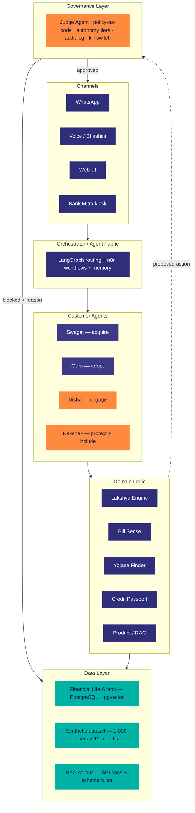

# SBI Sahayak

**A governed multi-agent AI platform that acts as a proactive digital relationship manager for every SBI customer.**

> Submission for SBI Hackathon 2026 (Global Fintech Fest) — Theme: **Agentic AI & Emerging Tech** · Problem Statement: **Digital Engagement**

---

## The Problem

SBI serves nearly 50 crore customers, but only a tiny fraction get a relationship manager. Everyone else gets nothing between account opening and a problem. The result: under 2 products per customer, crores of dormant accounts, billions in unclaimed government scheme benefits, and a service model that only reacts *after* a penalty has already hit.

Meanwhile, ~480 million adult Indians are "credit-unserved" with no CIBIL history — locked out of formal credit not because they're risky, but because they're invisible *(TransUnion CIBIL, 2022)*.

---

## The Solution

A governed agent operating layer SBI plugs its existing systems into — not another bolt-on chatbot. Four capabilities built on a persistent **Financial Life Graph**, all validated by an independent **Judge Agent** before anything reaches the customer.

### The four capabilities (all inside Disha, the Digital Engagement agent)

**Lakshya Engine — agentic auto-savings + gamification**
Detects a savings pattern from UPI/spending data (e.g., frequent electronics browsing) and proposes an opt-in goal on WhatsApp: *"Saving for a laptop? Shall I auto-sweep ₹200 from your food-delivery spend toward it?"* At 50% progress, surfaces eligibility to *apply* for a relevant SBI offer — banker-reviewed, never auto-granted.

**Bill Sense — prevent penalties before they happen**
Monitors upcoming recurring obligations (LIC premium, EMI, utility) and warns of a shortfall *before* a bounced payment or penalty, offering a one-tap, customer-confirmed transfer from another account.

**Yojana Finder — unclaimed entitlements, claimed**
Auto-detects eligibility for government schemes (PMJJBY, Sukanya Samriddhi, APY, PM-Kisan) from the customer's profile and initiates enrollment in-chat or via a Bank Mitra kiosk. Inspired by Commonwealth Bank's Benefits Finder, which connected customers to over $1B in entitlements.

**Rakshak — protection + inclusion**
- *Credit Passport* **[prototype]**: builds an explainable alternative-data profile (UPI consistency, bill-payment regularity, cash-flow stability) for thin-file customers and surfaces whether they may be eligible to *apply* for an SBI loan — routed to a human banker for approval. Targets India's ~480M credit-unserved adults.
- *Victim-Shield* **[roadmap]**: educates customers being unwittingly recruited as money mules and routes them to the bank's official fraud-help channel.
- *Scam-Shield* **[roadmap]**: warns of a flagged vendor or unusual transaction pattern during a UPI payment — *"Reply STOP to hold this payment."*

---

## The Mic-Drop Demo Moment

> Disha attempts a daily ₹200 Lakshya sweep — but the **Judge Agent blocks it** because Bill Sense detects an LIC premium due tomorrow. The customer is protected from a bounced-payment fee, automatically.

This single interaction proves safe, governed autonomy better than any architecture slide. It's shown live via the Langfuse audit panel during the demo.

---

## Architecture

---

## Governance & Trust

Every outbound action flows through the governance layer before it reaches a customer.

| Layer | Detail |
|---|---|
| **Judge Agent** | An independent, *different* model validates every Disha action against encoded RBI / UDAAP / KYC policy |
| **Policy-as-code** | Regulatory rules are design constraints, not afterthoughts |
| **Autonomy tiers** | T1 auto (informational) · T2 confirm (money movement) · T3 human-approval (lending, account restriction) |
| **Audit trail** | Immutable — every decision + Judge verdict + reason, shown live via Langfuse |
| **Kill switch** | Per-agent, always on (DBS PURE-inspired) |

**Key guardrails:** the agent never moves money silently, never promises a credit rate or approval, and never uses confidential regulator data.

---

## Tech Stack

| Layer | Choice |
|---|---|
| Customer agents | Claude API (default) |
| Judge Agent | Independent model (GPT-4o-class) for genuine cross-validation |
| Orchestration | Python + FastAPI · LangGraph · n8n |
| Language / voice | Bhashini APIs (12+ Indian languages) · Azure Speech fallback |
| Channels | WhatsApp Cloud API · Web UI · Twilio voice · Bank Mitra portal |
| Data | PostgreSQL + pgvector (Financial Life Graph + RAG) |
| Credit scoring | Explainable alternative-data scoring (UPI + bill-pay + cash-flow) |
| Observability | Langfuse (live agent traces in demo) |

---

## 30-Day Prototype Plan (if shortlisted 15 Jul)

| Week | Focus | Key output |
|---|---|---|
| 1 | Foundation | Repo layout, swappable LLM client, synthetic data generator, RAG, governance v0 |
| 2 | Engagement core | Financial Life Graph, Lakshya, Bill Sense, Yojana Finder, Credit Passport scoring, WhatsApp + Hindi voice |
| 3 | Govern + prove | Judge Agent, autonomy tiers, kill switch UI, eval harness (hallucination / containment / escalation) |
| 4 | Polish + pitch | Demo UI, live audit panel, demo video, pitch rehearsal — non-coding |

**Three golden demo paths:**
1. Hindi WhatsApp Lakshya goal — savings pattern → opt-in → sweep
2. Judge Agent blocks the sweep — mic-drop, shown live in Langfuse
3. Credit Passport → "eligible to apply" → routed to human approval

---

## Impact (Illustrative — to be validated in a pilot)

| Metric | Today | With Sahayak |
|---|---|---|
| Account opening time | 2-3 days | under 15 min |
| Onboarding completion | ~45% | 75%+ |
| Active digital adoption | ~35% | 65% |
| Products per customer | 1.8 | 3.0 (18 mo) |
| Service cost / interaction | ₹50-70 | under ₹5 |
| Credit-unserved reached | ~0 | new applicants via Credit Passport |

~₹1,900 Cr illustrative annual value per crore of active users (cost savings + revenue uplift).

---

## Status

**Idea-submission stage.** Prototype development begins only if shortlisted (top 10 announced 15 July 2026; 30-day build 15 Jul – 14 Aug 2026).

The prototype uses **100% synthetic data** — no real customer data, no live banking APIs, no access to any confidential regulator database.

---

## Author

**Uday Kumar Goel** — B.Tech CSE, Jind, Haryana, India.
Solo build using Claude Code + Antigravity IDE.
IP retained by the author per hackathon rules; SBI may pilot/commercialise via licence.
