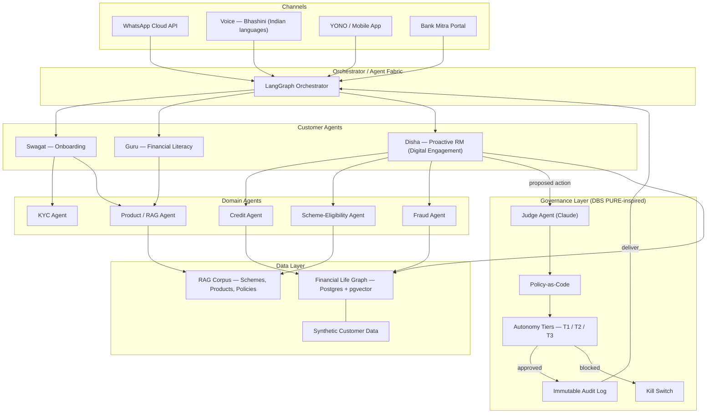

# SBI Sahayak

> A governed multi-agent AI platform that turns SBI into a proactive digital relationship manager for every customer.

**Hackathon:** SBI Hackathon 2026 — Global Fintech Fest
**Theme:** Digital Engagement

---

## The Problem

State Bank of India serves close to 50 crore customers, but dedicated relationship managers are economically viable for only a tiny sliver of that base. The remaining 99%+ get reactive, transactional service — they only hear from the bank when *they* initiate contact. Crores of rupees in government scheme benefits (PMJJBY, PMSBY, Atal Pension, Sukanya Samriddhi, KCC top-ups, state-level schemes) go unclaimed every year because customers simply don't know they qualify. Meanwhile, life events — a new job, a child's birth, a parent's hospitalisation, an EMI shortfall — happen silently in the transaction data and the bank does nothing.

## The Solution

SBI Sahayak is a multi-agent AI platform built around three customer-facing agents:

- **Swagat** — frictionless multilingual onboarding.
- **Guru** — on-demand financial literacy and product Q&A grounded in SBI's own corpus.
- **Disha** — the flagship. A proactive digital RM that reads each customer's transaction and UPI patterns through a **Financial Life Graph**, predicts life events, and acts *before* the customer asks.

Disha is the answer to the Digital Engagement theme: instead of waiting for the customer to log in, the bank reaches out with the right nudge, on the right channel, in the right language, at the right moment — and every outreach is governed.

## Killer Features

- **Yojana Finder** — automatically detects eligibility for central and state government schemes from the customer's life-graph and enrolls them in-chat over WhatsApp or voice.
- **Life-Event Prediction** — detects job changes, new dependents, medical spend, business income, and triggers context-aware product offers.
- **Bill Sense** — forecasts shortfalls on upcoming utility, EMI, and SIP debits and warns the customer days before a penalty hits.
- **Bank Mitra Co-pilot** — a tablet-side agent that briefs business correspondents on each walk-in customer's profile, eligible schemes, and recommended next action.

## Architecture

The source diagram lives at [docs/architecture.mmd](docs/architecture.mmd).

## Governance & Trust

No agent action reaches a customer without clearing the **Governance Layer** — inspired by DBS Bank's PURE framework for responsible AI.

- **Judge Agent** — an independent Claude-powered validator that scores every proposed action of a customer agent for policy fit, factuality, tone, and risk.
- **Policy-as-Code** — RBI guidelines, SBI internal product rules, consent requirements, and language/tone constraints are codified as machine-readable rules, version-controlled in the repo.
- **Autonomy Tiers** —
  - **T1:** agent may inform only (e.g., financial-literacy answer).
  - **T2:** agent may recommend an action; customer confirms (e.g., scheme enrollment).
  - **T3:** agent may execute autonomously within strict bounds (e.g., Bill Sense alert).
- **Immutable Audit Log** — every decision, prompt, model response, and policy verdict is logged with a hash chain for after-the-fact review.
- **Kill Switch** — a one-flip control that disables any agent globally, per channel, or per autonomy tier in seconds.

## Tech Stack

| Layer | Choice |
|---|---|
| Application framework | Python + FastAPI |
| Agent orchestration | LangGraph |
| Workflow automation | n8n |
| Customer-agent LLM | Azure OpenAI (GPT-4o) |
| Judge-agent LLM | Anthropic Claude |
| Data + vectors | PostgreSQL + pgvector |
| Voice (Indian languages) | Bhashini APIs |
| Messaging channel | WhatsApp Cloud API |
| Build tooling | Claude Code + Antigravity |

## 30-Day Build Plan

- **Week 1 — Foundation:** synthetic customer dataset, Financial Life Graph schema, LangGraph skeleton, FastAPI + Postgres scaffolding.
- **Week 2 — Engagement core:** Disha agent with Yojana Finder, Life-Event Prediction, and Bill Sense over WhatsApp + Bhashini voice.
- **Week 3 — Govern + evals:** judge agent, policy-as-code rules, autonomy tiers, audit log, kill switch, end-to-end eval harness.
- **Week 4 — Polish + pitch:** Bank Mitra co-pilot UI, three golden-path demos, deck, and submission video.

Roadmap detail: [docs/roadmap.md](docs/roadmap.md).

## Status

**Idea-submission stage.** This repository documents the concept, architecture, and build plan for the SBI Hackathon 2026 first round. Prototype implementation begins **if shortlisted on 15 July 2026** and runs against the 30-day plan above. No application code, customer data, or live banking APIs are in this repo — the prototype will use synthetic data only.

## Author

**Uday Goel** — Jind, Haryana. Solo build.
